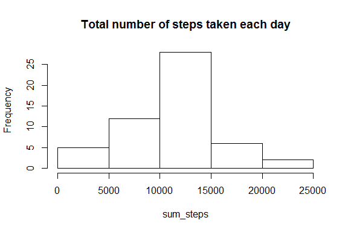
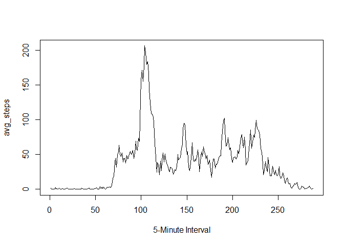

# Reproducible Research: Peer Assessment 1


## Loading and preprocessing the data

```r
setwd("./activity")
raw_data <- read.csv("activity.csv")
head(raw_data)
```

```
##   steps       date interval
## 1    NA 2012-10-01        0
## 2    NA 2012-10-01        5
## 3    NA 2012-10-01       10
## 4    NA 2012-10-01       15
## 5    NA 2012-10-01       20
## 6    NA 2012-10-01       25
```
## What is mean total number of steps taken per day?

- Calculate the total number of steps taken per day

```r
dates<-unique(raw_data$date)
sum_steps<-seq(0,0,length=61)
for (i in 1:61){
  sum_steps[i]<-sum(raw_data[raw_data$date == dates[i], "steps"])
}
```


- Make a histogram of the total number of steps taken each day

```r
hist(sum_steps, main="Total number of steps taken each day")
```

 


- Calculate and report the mean and median of the total number of steps taken per day

```r
mean_steps<-mean(sum_steps[!is.na(sum_steps)])
median_steps<-median(sum_steps[!is.na(sum_steps)])
```
The mean is 1.0766189\times 10^{4} and the median is 1.0765\times 10^{4}

## What is the average daily activity pattern?
- Make a time series plot (i.e. type = "l") of the 5-minute interval (x-axis) and the average number of steps taken, averaged across all days (y-axis).

```r
clean_data<-raw_data[!is.na(raw_data$steps),]
minutes<-unique(clean_data$interval)
avg_steps<-seq(0,0,length=length(minutes))
for (i in 1:length(minutes)){
  avg_steps[i]<-mean(clean_data[clean_data$interval == minutes[i], "steps"])
}
plot(1:length(minutes), avg_steps, type="l", xlab="5-Minute Interval")
```

 

- Which 5-minute interval, on average across all the days in the dataset, contains the maximum number of steps?

```r
max_minute<-minutes[avg_steps==max(avg_steps)]
max_interval<-which(minutes==max_minute)
```
On average, the maximum number of steps is on the 104th 5-minute interval of the day, when the time-interval value equals 835. 

## Imputing missing values
Note that there are a number of days/intervals where there are missing values (coded as NA). The presence of missing days may introduce bias into some calculations or summaries of the data.

- Calculate and report the total number of missing values in the dataset (i.e. the total number of rows with NAs)

```r
na_id <- raw_data[is.na(raw_data$steps), "steps"]
number_na <- length(na_id)
number_na
```

```
## [1] 2304
```
There are 2304 missing values in the dataset.

- Devise a strategy for filling in all of the missing values in the dataset. The strategy does not need to be sophisticated. For example, you could use the mean/median for that day, or the mean for that 5-minute interval, etc.

- Create a new dataset that is equal to the original dataset but with the missing data filled in


```r
# Identify which index have NA values
na_index <- which(is.na(raw_data[,"steps"]))
pre_data <- raw_data

# Change the NA values by the average value in that 5-minute interval
for (i in na_index){
     pre_data[i,"steps"]<-avg_steps[which(minutes == pre_data[i,"interval"])]
}
```


## Are there differences in activity patterns between weekdays and weekends?
